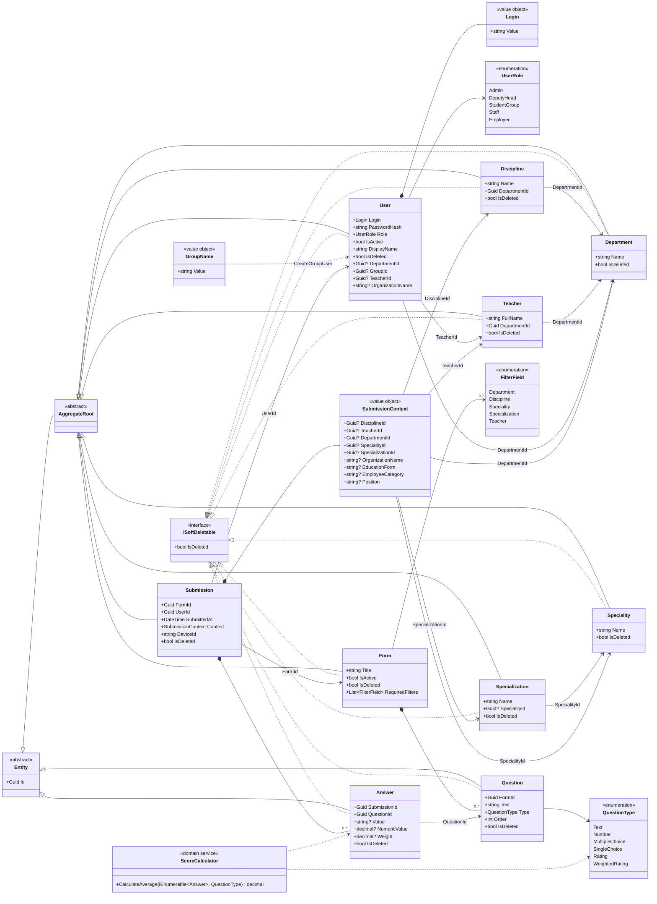

# Domain UML

```mermaid
classDiagram
direction LR

class Entity {
  <<abstract>>
  +Guid Id
}

class AggregateRoot {
  <<abstract>>
}

class ISoftDeletable {
  <<interface>>
  +bool IsDeleted
}

Entity <|-- AggregateRoot

class User {
  +Login Login
  +string PasswordHash
  +UserRole Role
  +bool IsActive
  +string DisplayName
  +bool IsDeleted
  +Guid? DepartmentId
  +Guid? GroupId
  +Guid? TeacherId
  +string? OrganizationName
}

class Login {
  <<value object>>
  +string Value
}

class GroupName {
  <<value object>>
  +string Value
}

class UserRole {
  <<enumeration>>
  Admin
  DeputyHead
  StudentGroup
  Staff
  Employer
}

AggregateRoot <|-- User
ISoftDeletable <|.. User
User *-- Login
User --> UserRole
GroupName ..> User : CreateGroupUser

class Department {
  +string Name
  +bool IsDeleted
}

class Discipline {
  +string Name
  +Guid DepartmentId
  +bool IsDeleted
}

class Teacher {
  +string FullName
  +Guid DepartmentId
  +bool IsDeleted
}

class Speciality {
  +string Name
  +bool IsDeleted
}

class Specialization {
  +string Name
  +Guid? SpecialityId
  +bool IsDeleted
}

AggregateRoot <|-- Department
AggregateRoot <|-- Discipline
AggregateRoot <|-- Teacher
AggregateRoot <|-- Speciality
AggregateRoot <|-- Specialization

ISoftDeletable <|.. Department
ISoftDeletable <|.. Discipline
ISoftDeletable <|.. Teacher
ISoftDeletable <|.. Speciality
ISoftDeletable <|.. Specialization

Discipline --> Department : DepartmentId
Teacher --> Department : DepartmentId
Specialization --> Speciality : SpecialityId
User --> Department : DepartmentId
User --> Teacher : TeacherId

class Form {
  +string Title
  +bool IsActive
  +bool IsDeleted
  +List~FilterField~ RequiredFilters
}

class Question {
  +Guid FormId
  +string Text
  +QuestionType Type
  +int Order
  +bool IsDeleted
}

class QuestionType {
  <<enumeration>>
  Text
  Number
  MultipleChoice
  SingleChoice
  Rating
  WeightedRating
}

class FilterField {
  <<enumeration>>
  Department
  Discipline
  Speciality
  Specialization
  Teacher
}

AggregateRoot <|-- Form
Entity <|-- Question
ISoftDeletable <|.. Form
ISoftDeletable <|.. Question
Form *-- "0..*" Question
Question --> QuestionType
Form --> "0..*" FilterField

class Submission {
  +Guid FormId
  +Guid UserId
  +DateTime SubmittedAt
  +SubmissionContext Context
  +string DeviceId
  +bool IsDeleted
}

class Answer {
  +Guid SubmissionId
  +Guid QuestionId
  +string? Value
  +decimal? NumericValue
  +decimal? Weight
  +bool IsDeleted
}

class SubmissionContext {
  <<value object>>
  +Guid? DisciplineId
  +Guid? TeacherId
  +Guid? DepartmentId
  +Guid? SpecialityId
  +Guid? SpecializationId
  +string? OrganizationName
  +string? EducationForm
  +string? EmployeeCategory
  +string? Position
}

AggregateRoot <|-- Submission
Entity <|-- Answer
ISoftDeletable <|.. Answer
Submission *-- "0..*" Answer
Submission *-- SubmissionContext
Submission --> Form : FormId
Submission --> User : UserId
SubmissionContext --> Discipline : DisciplineId
SubmissionContext --> Teacher : TeacherId
SubmissionContext --> Department : DepartmentId
SubmissionContext --> Speciality : SpecialityId
SubmissionContext --> Specialization : SpecializationId
Answer --> Question : QuestionId

class ScoreCalculator {
  <<domain service>>
  +CalculateAverage(IEnumerable~Answer~, QuestionType) decimal
}

ScoreCalculator ..> Answer
ScoreCalculator ..> QuestionType
```
